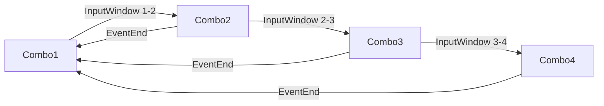
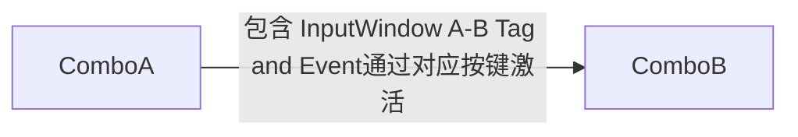

# GASARPG学习笔记


## 使用说明

### 连招系统

#### 基础连招


如图，InputWindow A-B(指令输入区间)是动画蒙太奇中的一个***AnimNotify State*** 。

Notify Sate开始时，会给激活技能的Actor添加***InputWindow A-B***的***Gameplay Tag***。

这个***Gameplay Tag***是下一个Combo攻击的触发条件。



Notify State结束后， 会将该Actor的***InputWindow A-B***的***Gameplay Tag***移除。

除了Combo1以外，其它Combo在指令输入区间外输入指令都不会触发下一个攻击动作。

Combo1没有输入指令区间的判定，也就是说在输入区间以外的时候进行攻击输入都会激活Combo1。


这不是理想的情况，因为这样会造成动作没播完的时候被Combo1打断。我们可以通过往***Activition Blocked Tags***添加```Ability.State```来避免这个问题。

***Activition Blocked Tags***的作用如下图


所有攻击技能被激活时都会被赋予```Ability.State```的标签，在这些技能执行期间，Combo1会被阻拦。
